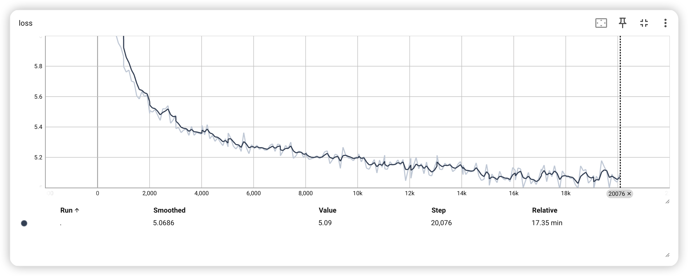
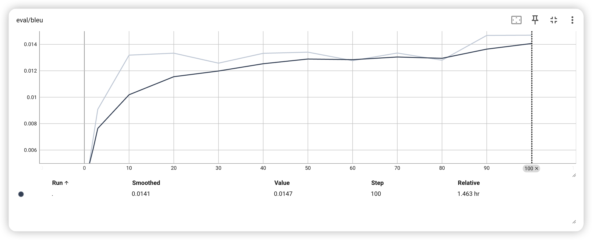
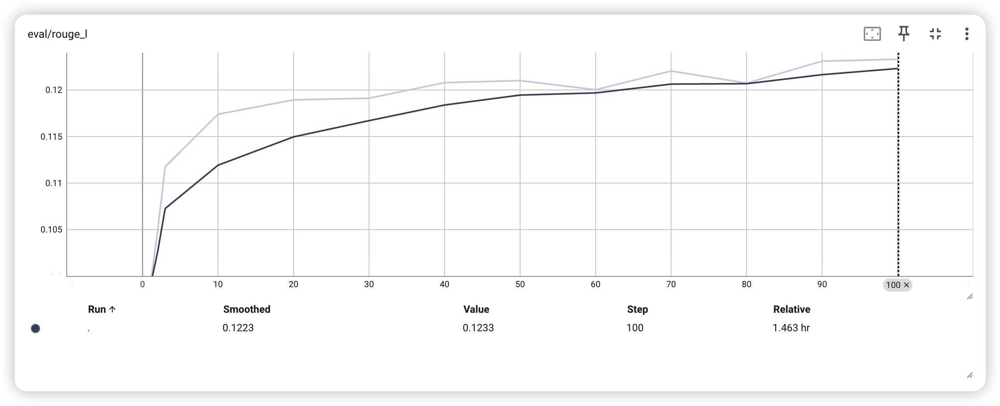
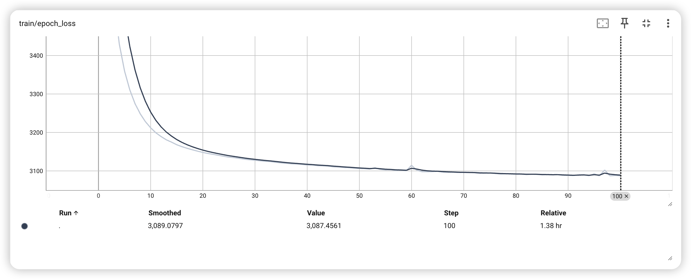
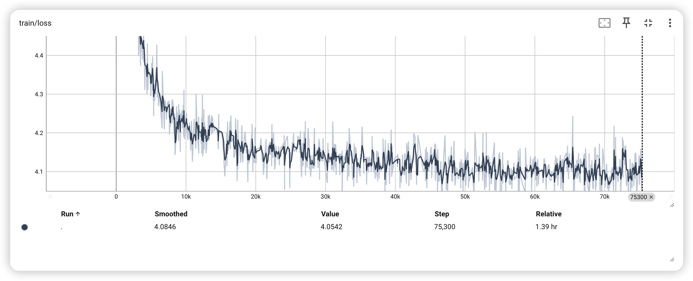
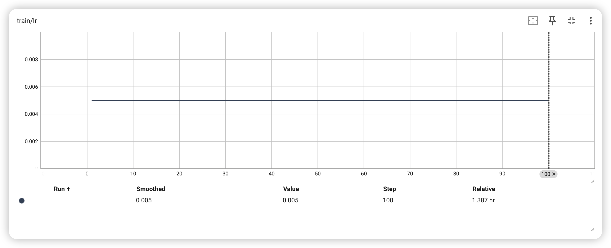

# Verify

# GRU

Epoch 10:
accumulation loss: 3212.12
上联：马齿草焉无马齿。 预测的下联：羊皮羊也有龙头
上联：天古天今，地中地外，古今中外存天地。 预测的下联：人间天下，人间天下，天下天下有人间
上联：笑取琴书温旧梦。 预测的下联：欣逢春雨润新诗
上联：日里千人拱手划船，齐歌狂吼川江号子。 预测的下联：天下一路同心同心，共建和谐社会和谐
上联：我有诗情堪纵酒。 预测的下联：谁能意气不成诗
上联：我以真诚溶冷血。 预测的下联：谁能明月照清心
上联：三世业岐黄，妙手回春人共赞。 预测的下联：一方人世界，金鸡报晓我同歌
BLEU: 0.013184153, Rouge-L: 0.11739509

Epoch 20:
accumulation loss: 3148.09
上联：马齿草焉无马齿。 预测的下联：羊肠月也有牛头
上联：天古天今，地中地外，古今中外存天地。 预测的下联：人杰地杰，天地天地，人杰地灵有天地
上联：笑取琴书温旧梦。 预测的下联：闲看月色醉清风
上联：日里千人拱手划船，齐歌狂吼川江号子。 预测的下联：天边一路通衢通路，喜看人间锦绣河山
上联：我有诗情堪纵酒。 预测的下联：谁无情愫不沾尘
上联：我以真诚溶冷血。 预测的下联：谁能明月照清心
上联：三世业岐黄，妙手回春人共赞。 预测的下联：一生情化雨，新风送福地同歌
BLEU: 0.013333822, Rouge-L: 0.11893255

Epoch 30:
accumulation loss: 3127.75
上联：马齿草焉无马齿。 预测的下联：羊毫毫也有龙头
上联：天古天今，地中地外，古今中外存天地。 预测的下联：地天地杰，地地天天，天地天天天地天
上联：笑取琴书温旧梦。 预测的下联：闲吟诗句醉春风
上联：日里千人拱手划船，齐歌狂吼川江号子。 预测的下联：天下一地同心同忾，同建中华国运民心
上联：我有诗情堪纵酒。 预测的下联：谁无俗事不留香
上联：我以真诚溶冷血。 预测的下联：谁能不敢负青天
上联：三世业岐黄，妙手回春人共赞。 预测的下联：一家情厚厚，新风入户户同歌
BLEU: 0.012578686, Rouge-L: 0.11911248

Epoch 40:
accumulation loss: 3115.55
上联：马齿草焉无马齿。 预测的下联：羊毫羊也有牛蹄
上联：天古天今，地中地外，古今中外存天地。 预测的下联：地灵地灵，地灵地灵，天地天地有神州
上联：笑取琴书温旧梦。 预测的下联：闲吟诗酒醉新春
上联：日里千人拱手划船，齐歌狂吼川江号子。 预测的下联：天下一路同舟共济，共建和谐社会和谐
上联：我有诗情堪纵酒。 预测的下联：谁知酒梦可成诗
上联：我以真诚溶冷血。 预测的下联：谁将浩气壮长河
上联：三世业岐黄，妙手回春人共赞。 预测的下联：一方天地起，新风入梦梦常圆
BLEU: 0.013322344, Rouge-L: 0.12078558

Epoch 50:
accumulation loss: 3106.16
上联：马齿草焉无马齿。 预测的下联：羊毫春也有牛皮
上联：天古天今，地中地外，古今中外存天地。 预测的下联：人和物阜，物阜民康，世纪风光耀日光
上联：笑取琴书温旧梦。 预测的下联：闲吟诗酒醉新春
上联：日里千人拱手划船，齐歌狂吼川江号子。 预测的下联：天下一片放心牵手，共建家园幸福家园
上联：我有诗情堪纵酒。 预测的下联：谁无笔墨可留情
上联：我以真诚溶冷血。 预测的下联：我将大义铸忠魂
上联：三世业岐黄，妙手回春人共赞。 预测的下联：一方人美德，金风伴我梦同圆
BLEU: 0.013410581, Rouge-L: 0.12100627

Epoch 60:
accumulation loss: 3114.59
上联：马齿草焉无马齿。 预测的下联：羊肠春也有牛皮
上联：天古天今，地中地外，古今中外存天地。 预测的下联：人和人杰，天下人间，天下人间有天涯
上联：笑取琴书温旧梦。 预测的下联：闲看竹影醉清风
上联：日里千人拱手划船，齐歌狂吼川江号子。 预测的下联：风中一日飞花落日，共醉春秋春色秋冬
上联：我有诗情堪纵酒。 预测的下联：谁知酒醉可销魂
上联：我以真诚溶冷血。 预测的下联：谁将浩气壮长城
上联：三世业岐黄，妙手回春人共赞。 预测的下联：一家家幸福，红梅贺岁我同欢
BLEU: 0.012768921, Rouge-L: 0.120022

Epoch 70:
accumulation loss: 3095.96
上联：马齿草焉无马齿。 预测的下联：羊毫毫也有毫锋
上联：天古天今，地中地外，古今中外存天地。 预测的下联：人和物阜，物阜民康，万里江山是古今
上联：笑取琴书温旧梦。 预测的下联：闲看竹叶写新诗
上联：日里千人拱手划船，齐歌狂吼川江号子。 预测的下联：天下一路通天路路，通路通通路路通衢
上联：我有诗情堪纵酒。 预测的下联：谁无意意不关情
上联：我以真诚溶冷血。 预测的下联：谁能大爱报春晖
上联：三世业岐黄，妙手回春人共赞。 预测的下联：一方天地利，和谐为国梦同圆
BLEU: 0.013344368, Rouge-L: 0.12203871

Epoch 80:
accumulation loss: 3091.51
上联：马齿草焉无马齿。 预测的下联：羊皮山也有牛皮
上联：天古天今，地中地外，古今中外存天地。 预测的下联：人和人杰，人杰人杰，古今古今是古今
上联：笑取琴书温旧梦。 预测的下联：闲谈岁月醉新愁
上联：日里千人拱手划船，齐歌狂吼川江号子。 预测的下联：风中万里飞歌舞舞，共庆同欢共庆团圆
上联：我有诗情堪纵酒。 预测的下联：谁无俗事不成诗
上联：我以真诚溶冷血。 预测的下联：我为大爱献丹心
上联：三世业岐黄，妙手回春人共赞。 预测的下联：九州人富裕，和风入梦梦常圆
BLEU: 0.012800371, Rouge-L: 0.12073635

Epoch 90:
accumulation loss: 3088.52
上联：马齿草焉无马齿。 预测的下联：羊皮风也有花香
上联：天古天今，地中地外，古今中外存天地。 预测的下联：人和人杰，人杰地灵，今古人文蔚古今
上联：笑取琴书温旧梦。 预测的下联：闲吟竹菊醉清风
上联：日里千人拱手划船，齐歌狂吼川江号子。 预测的下联：风中万里扬帆竞渡，共赏高歌盛世和谐
上联：我有诗情堪纵酒。 预测的下联：谁无俗事不关情
上联：我以真诚溶冷血。 预测的下联：人无俗累是清风
上联：三世业岐黄，妙手回春人共赞。 预测的下联：九州花锦绣，和风给力燕齐飞
BLEU: 0.014677112, Rouge-L: 0.1230936

Epoch 100:
accumulation loss: 3087.46
上联：马齿草焉无马齿。 预测的下联：羊毫毫也有毫毛
上联：天古天今，地中地外，古今中外存天地。 预测的下联：人和人杰，人杰人杰，古今人杰壮山河
上联：笑取琴书温旧梦。 预测的下联：闲听琴瑟诉衷肠
上联：日里千人拱手划船，齐歌狂吼川江号子。 预测的下联：风中八面迎春暖客，共赏同游天地人文
上联：我有诗情堪纵酒。 预测的下联：谁无俗事不沾尘
上联：我以真诚溶冷血。 预测的下联：谁能大爱有高风
上联：三世业岐黄，妙手回春人共赞。 预测的下联：一方心大爱，和风入户梦常圆
BLEU: 0.014696447, Rouge-L: 0.12329268

